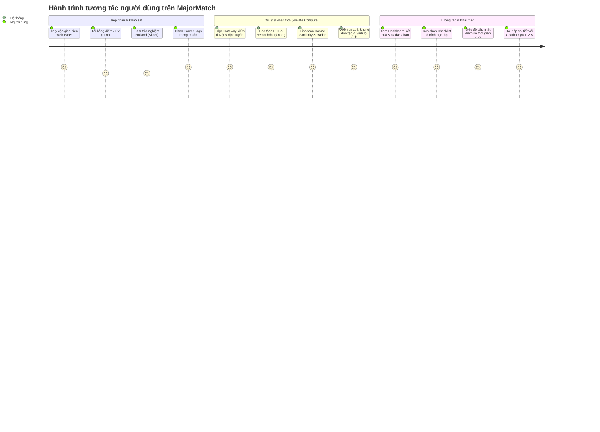

# TÀI LIỆU YÊU CẦU SẢN PHẨM (PRODUCT REQUIREMENTS DOCUMENT - PRD)

## TÊN DỰ ÁN: MAJORMATCH
### Hệ thống phân tích kỹ năng và định hướng học tập thông minh cho học sinh, sinh viên
**Phiên bản:** 1.0.0  
**Trạng thái:** Approved / Architectural Baseline  
**Tác giả:** Chief Cloud Solutions Architect & Technical Lead  
**Ngày phê duyệt:** 05/09/2026  

---

## 1. TỔNG QUAN SẢN PHẨM & TẦM NHÌN (PRODUCT OVERVIEW & VISION)

### 1.1. Tầm nhìn sản phẩm (Vision Statement)
**MajorMatch** được xây dựng nhằm trở thành nền tảng cố vấn học tập và định hướng nghề nghiệp cá nhân hóa hàng đầu dành cho học sinh THPT và sinh viên đại học. Thay vì đưa ra các lời khuyên chung chung theo cảm tính, hệ thống ứng dụng mô hình trí tuệ nhân tạo (AI) và học máy (ML) kết hợp kiến trúc **Hybrid Cloud Multi-tier** để phân tích định lượng khoảng cách kỹ năng (Skill Gap), đối chiếu trực tiếp với chuẩn chương trình đào tạo đại học và yêu cầu thực tế của thị trường tuyển dụng.

### 1.2. Mục tiêu chiến lược (Strategic Goals)
1. **Định lượng hóa năng lực:** Chuyển đổi dữ liệu học tập phi cấu trúc (bảng điểm PDF, CV cá nhân) thành các chỉ số kỹ năng cụ thể trên không gian vector, tính toán độ tương đồng toán học (Cosine Similarity).
2. **Cá nhân hóa lộ trình:** Tự động sinh lộ trình học tập chi tiết theo từng kỳ học (Milestone Tree), tích hợp tính năng Web 2.0 cho phép cập nhật trạng thái động khi hoàn thành môn học.
3. **Bảo mật dữ liệu học tập tuyệt đối:** Bảo đảm toàn vẹn dữ liệu nhạy cảm (Confidential Data) như bảng điểm, điểm số GPA, danh tính sinh viên bằng việc cô lập 100% quá trình trích xuất và tính toán AI trên máy chủ tính toán nội bộ (Private HPC Node), không gửi qua bất kỳ dịch vụ SaaS AI công cộng nào.
4. **Tối ưu hóa chi phí vận hành:** Tận dụng hạ tầng thiết bị biên (Edge Device) và phần cứng tính toán GPU nội bộ (tối thiểu 6GB VRAM, khuyến nghị 8GB+ VRAM) kết hợp CDN/Edge Hosting miễn phí (Vercel) để loại bỏ hoàn toàn chi phí thuê server GPU đắt đỏ trên Public Cloud.

---

## 2. CHÂN DUNG NGƯỜI DÙNG & ĐỐI TƯỢNG HƯỞNG LỢI (USER PERSONAS)

### Persona 1: Sinh viên Đại học (Trọng tâm)
* **Đại diện:** Nguyễn Văn An - Sinh viên năm 2 ngành Công nghệ Thông tin.
* **Đặc điểm:** Đã hoàn thành một số môn cơ sở ngành nhưng mất phương hướng giữa các chuyên ngành hẹp (Data Science, Software Engineering, DevOps, Cybersecurity).
* **Pain Points:** 
  * Không biết các môn mình đã học tương ứng với bao nhiêu % yêu cầu công việc thực tế.
  * Ngại chia sẻ bảng điểm cá nhân lên các công cụ AI trực tuyến vì lo ngại lộ thông tin riêng tư.
  * Thiếu một kế hoạch hành động cụ thể từng kỳ học để bù đắp các lỗ hổng kiến thức.
* **Mục tiêu trong hệ thống:** Tải bảng điểm PDF lên, nhận báo cáo Radar Chart đánh giá độ phù hợp với từng chuyên ngành, và nhận lộ trình môn học tự chọn kèm đồ án cần làm.

### Persona 2: Học sinh THPT Chuẩn bị Vào Đại học
* **Đại diện:** Lê Thị Bình - Học sinh lớp 12 chuyên Tự nhiên.
* **Đặc điểm:** Chưa có bảng điểm đại học hay CV kỹ thuật, chỉ có điểm học bạ và sở thích cá nhân.
* **Pain Points:** Phân vân giữa các nhóm ngành kỹ thuật và kinh tế; thông tin tư vấn tuyển sinh đại trà mang tính quảng cáo.
* **Mục tiêu trong hệ thống:** Làm bài trắc nghiệm Holland Code (RIASEC) 10 câu trượt nhanh, chọn các thẻ lĩnh vực quan tâm, nhận gợi ý Top 3 ngành đào tạo phù hợp nhất và khung môn học đại cương sẽ phải đối mặt.

### Persona 3: Cố vấn Học tập & Giảng viên
* **Đặc điểm:** Cần dữ liệu chuẩn xác để tư vấn cho sinh viên đang có cảnh báo học tập hoặc có nhu cầu chuyển ngành.
* **Mục tiêu trong hệ thống:** Sử dụng chuẩn dữ liệu đầu ra của MajorMatch để xác định môn tiên quyết sinh viên cần học bổ sung để đủ điều kiện xét tốt nghiệp hoặc chuyển chuyên ngành.

---

## 3. HÀNH TRÌNH NGƯỜI DÙNG (USER JOURNEY & WORKFLOWS)

---

## 4. YÊU CẦU CHỨC NĂNG CHI TIẾT (FUNCTIONAL REQUIREMENTS - FR)

### 4.1. Phân hệ FR-1: Tiếp nhận & Tiền xử lý Hồ sơ (Profile Ingestion)
* **FR-1.1:** Hệ thống hỗ trợ kéo thả tệp tài liệu định dạng `.pdf` với dung lượng tối đa 10MB.
* **FR-1.2:** Module tiếp nhận phải xác thực MIME type và magic bytes để ngăn chặn tải lên các file thực thi giả mạo.
* **FR-1.3:** Hệ thống cung cấp bảng khảo sát Holland Code rút gọn gồm 10 câu hỏi dạng thang trượt (Slider 1–5 điểm) phân bổ theo 6 nhóm tính cách RIASEC:
  * Realistic (Thực tế)
  * Investigative (Nghiên cứu)
  * Artistic (Nghệ thuật)
  * Social (Xã hội)
  * Enterprising (Quản lý / Khởi nghiệp)
  * Conventional (Quy củ / Chi tiết)
* **FR-1.4:** Cho phép người dùng chọn tối đa 5 thẻ định hướng nghề nghiệp (Target Career Tags) từ danh mục hệ thống định sẵn (ví dụ: Fullstack Developer, AI Engineer, Data Analyst, Cloud Architect, v.v.).

### 4.2. Phân hệ FR-2: Trích xuất Dữ liệu & Bóc tách Thực thể (Extraction Engine)
* **FR-2.1:** Dịch vụ xử lý cục bộ trên Private Node bóc tách toàn bộ text từ PDF bằng `PyPDF`/`pdfplumber`.
* **FR-2.2:** Áp dụng hệ thống biểu thức chính quy (Regex Pattern Engine) để nhận diện cấu trúc bảng điểm:
  * Mã môn học (Course Code).
  * Tên môn học (Course Name).
  * Số tín chỉ (Credits).
  * Điểm hệ chữ (Letter Grade: A, B, C, D, F) và hệ số 4.0 / 10.0.
  * Điểm trung bình tích lũy (Cumulative GPA).
* **FR-2.3:** Bóc tách CV: Trích xuất các section chuẩn (Education, Work Experience, Technical Skills, Projects, Certifications).
* **FR-2.4:** Loại bỏ hoàn toàn các thông tin định danh cá nhân nhạy cảm (PII: Số CCCD, Địa chỉ nhà, Số điện thoại cá nhân) trước khi đưa dữ liệu vào pipeline vector hóa.

### 4.3. Phân hệ FR-3: Định lượng Năng lực & Khoảng cách Kỹ năng (Skill Gap Engine)
* **FR-3.1:** Vector hóa tập kỹ năng trích xuất từ người dùng ($S_{user}$) và ma trận kỹ năng chuẩn của các chuyên ngành ($S_{benchmark}$).
* **FR-3.2:** Sử dụng thuật toán đo độ tương đồng Cosine Similarity để tính điểm tương hợp Match Score (%):
  $$\text{MatchScore}(S_{user}, S_{major}) = \frac{S_{user} \cdot S_{major}}{\|S_{user}\| \|S_{major}\|} \times 100\%$$
* **FR-3.3:** Tính toán phân rã kỹ năng thành 3 tập hợp rõ ràng:
  * **Mastered Skills (Kỹ năng đã đạt):** Các kỹ năng có điểm số môn học tương ứng $\ge 3.0/4.0$ hoặc có minh chứng dự án trong CV.
  * **Developing Skills (Kỹ năng đang phát triển):** Các kỹ năng đã tiếp cận ở mức cơ sở ($2.0 \le \text{Điểm} < 3.0$).
  * **Missing Skills (Kỹ năng còn thiếu):** Các kỹ năng bắt buộc của ngành chuẩn mà người dùng chưa từng học hoặc chưa có trong hồ sơ.
* **FR-3.4:** Xuất dữ liệu tọa độ 6–8 trục chuẩn hóa (thang 1–10) phục vụ vẽ biểu đồ Radar Chart (mạng nhện) trên Frontend.

### 4.4. Phân hệ FR-4: Suy luận Ngữ cảnh & Tự động Sinh Lộ trình (RAG & Roadmap Engine)
* **FR-4.1:** Sử dụng Vector Database (`ChromaDB`) lưu trữ toàn bộ khung chương trình đào tạo chuẩn của các trường đại học (danh mục môn tiên quyết, môn bắt buộc, môn tự chọn, đồ án tốt nghiệp).
* **FR-4.2:** Truy vấn RAG (Retrieval-Augmented Generation): Tìm kiếm các môn học trong cơ sở dữ liệu có khả năng bù đắp trực tiếp các **Missing Skills** từ FR-3.3.
* **FR-4.3:** Sử dụng mô hình ngôn ngữ lớn chạy nội bộ (Ollama - Qwen 2.5 7B) để tổng hợp prompt có ngữ cảnh và xuất ra cấu trúc dữ liệu JSON nghiêm ngặt:
  * Danh sách kỳ học đề xuất (Semester 1..N).
  * Các môn học trọng tâm cần đăng ký kèm lý do học.
  * Chứng chỉ nghề nghiệp đề xuất (ví dụ: AWS Certified Developer, CompTIA Security+).
  * Đồ án thực chiến cá nhân (Portfolio Projects) để bổ sung vào CV.
* **FR-4.4:** Cơ chế sinh lộ trình phải bảo đảm tính logic về môn học tiên quyết (Prerequisites Chain Validation): Không bao giờ đề xuất môn học nâng cao khi môn tiên quyết chưa đạt.

### 4.5. Phân hệ FR-5: Không gian Tương tác Động Web 2.0 (Interactive Workspace)
* **FR-5.1:** Giao diện điều khiển (Dashboard) hiển thị trực quan thẻ xếp hạng Top 3 ngành phù hợp nhất kèm % match score.
* **FR-5.2:** Biểu đồ Radar Chart tương tác (Recharts) hiển thị đồng thời 2 lớp: Năng lực hiện tại của sinh viên và Tiêu chuẩn ngành yêu cầu.
* **FR-5.3:** Lộ trình học tập hiển thị dạng Interactive Checklist:
  * Khi người dùng tích chọn vào một mục "Đã hoàn thành môn X" hoặc "Đã lấy chứng chỉ Y", trạng thái ứng dụng phía Client tự động tính toán lại điểm số tương thích.
  * Biểu đồ Radar co giãn và thanh tiến độ (% Job Readiness) tăng lên ngay lập tức mà không cần tải lại trang (Single Page Application Web 2.0 state management).
* **FR-5.4:** Trợ lý ảo cố vấn (Streaming Assistant Chatbot): Cho phép người dùng chat trực tiếp với mô hình Qwen 2.5 7B theo dạng phản hồi từng token (Server-Sent Events / Streaming), hỗ trợ hỏi sâu về phương pháp học và giải thích chi tiết lý do gợi ý môn học.

### 4.6. Phân hệ FR-6: Cổng Điều phối Biên & An toàn Hệ thống (Edge Gateway Control)
* **FR-6.1:** Tiếp nhận toàn bộ lưu lượng HTTPS từ Public PaaS qua đường hầm mã hóa Cloudflare Tunnel.
* **FR-6.2:** Áp dụng thuật toán giới hạn tần suất Token Bucket Rate Limiting: Giới hạn tối đa 10 requests/phút cho mỗi IP đối với các endpoint nặng về suy luận AI/ML.
* **FR-6.3:** Bộ đệm phản hồi (Response Cache) với SQLite trên Edge Gateway: Lưu trữ các kết quả phân tích chuẩn đối với các hồ sơ mẫu hoặc dữ liệu khung chương trình tĩnh, giảm tải trực tiếp cho máy tính GPU.

---

## 5. YÊU CẦU PHI CHỨC NĂNG (NON-FUNCTIONAL REQUIREMENTS - NFR)

### 5.1. Hiệu năng & Độ trễ (Performance & Latency)
* **NFR-1.1 (PDF Ingestion):** Thời gian bóc tách và phân tích dữ liệu bảng điểm PDF dung lượng $\le 5\text{MB}$ không vượt quá **1.2 giây**.
* **NFR-1.2 (ML Matching):** Thời gian tính toán ma trận Cosine Similarity và xuất tọa độ Radar Chart không vượt quá **500 miligiây**.
* **NFR-1.3 (LLM Inference):** Tốc độ sinh phản hồi của mô hình Qwen 2.5 7B trên GPU chuyên dụng đạt tối thiểu **40 - 55 tokens/giây**. Thời gian nhận token đầu tiên (Time-to-First-Token - TTFT) dưới **800 miligiây**.
* **NFR-1.4 (Frontend Responsiveness):** Điểm hiệu năng Lighthouse trên nền tảng Vercel đạt $\ge 90$ điểm; Time to Interactive (TTI) dưới **1.5 giây**.

### 5.2. An toàn & Bảo mật Dữ liệu (Security & Privacy)
* **NFR-2.1 (Confidential Isolation):** Không có bất kỳ dữ liệu cá nhân nào (PDF bảng điểm, tên sinh viên, GPA) được lưu trữ trên Public Cloud (Vercel). Toàn bộ dữ liệu này được chuyển thẳng qua kênh trung chuyển mã hóa về Private HPC Node.
* **NFR-2.2 (Transport Security):** Toàn bộ giao tiếp mạng từ Client -> Vercel -> Edge Gateway -> Private Compute Node bắt buộc sử dụng mã hóa TLS 1.3 với chứng chỉ tự động của Cloudflare.
* **NFR-2.3 (Local Ephemeral Processing):** Các tệp PDF tải lên để bóc tách trên Private Node sau khi phân tích xong phải được dọn dẹp hoặc mã hóa lưu trữ nội bộ theo chính sách quản lý phiên (Session-based cleanup).
* **NFR-2.4 (No Third-Party AI Data Leakage):** Tuyệt đối không tích hợp API key của các bên thứ ba (OpenAI, Anthropic) cho tác vụ xử lý thông tin cá nhân của người dùng.

### 5.3. Khả năng Chịu tải & Phục hồi (Availability & Resilience)
* **NFR-3.1 (GPU Backpressure Protection):** Tầng Edge Gateway (Nginx) hoạt động như một bộ đệm hàng đợi (Queue buffer). Khi Private GPU Node đang xử lý 100% công suất, Gateway trả về mã HTTP `429 Too Many Requests` hoặc chuyển sang chế độ hàng đợi xếp lượt văn minh, tránh hiện tượng Out Of Memory (OOM) trên GPU.
* **NFR-3.2 (Offline Resilience):** Nếu mất kết nối Internet công cộng, các thành phần tại Tầng 2 và Tầng 3 vẫn có thể hoạt động cục bộ qua mạng LAN nội bộ (Local Offline Mode).

### 5.4. Tính Tương thích & Khả năng Dùng được (Compatibility & Usability)
* **NFR-4.1 (Cross-Platform):** Giao diện Web hiển thị tối ưu trên cả thiết bị di động (Mobile responsive) và máy tính để bàn (Desktop viewport 1920x1080).
* **NFR-4.2 (Accessibility):** Đạt tiêu chuẩn tối thiểu WCAG 2.1 Level AA về độ tương phản màu sắc và hỗ trợ điều hướng bằng bàn phím.

---

## 6. MA TRẬN PHÂN CHIA TRÁCH NHIỆM PHÂN TẦNG HỆ THỐNG

| Chức năng nghiệp vụ | Tầng 1: Public PaaS (Vercel) | Tầng 2: Edge Gateway | Tầng 3: Private HPC Node |
| :--- | :---: | :---: | :---: |
| **Giao diện người dùng & Form tải file** | Chịu trách nhiệm chính | Không | Không |
| **Quản lý Dynamic State (Checklist, Slider)** | Chịu trách nhiệm chính | Không | Không |
| **Vẽ biểu đồ tương tác (Radar Recharts)** | Chịu trách nhiệm chính | Không | Không |
| **Định tuyến & Thiết lập đường hầm bảo mật** | Client gọi Endpoint | Cloudflare Tunnel / Nginx | Nhận Request nội bộ |
| **Chống tấn công DoS & Rate Limiting** | Không | Chịu trách nhiệm chính | Không |
| **Lưu cache khung chương trình chuẩn** | Không | SQLite Cache | Đồng bộ định kỳ |
| **Trích xuất văn bản từ PDF bảng điểm** | Không | Không | Chịu trách nhiệm chính |
| **Vector hóa & Thuật toán Cosine Similarity** | Không | Không | Chịu trách nhiệm chính |
| **Lưu trữ Vector Database (ChromaDB)** | Không | Không | Chịu trách nhiệm chính |
| **Chạy mô hình Qwen 2.5 7B (Ollama)** | Không | Không | Chịu trách nhiệm chính |

---

## 7. TIÊU CHÍ NGHIỆM THU TỔNG THỂ (ACCEPTANCE CRITERIA)

1. **AC-01:** Người dùng tải lên bảng điểm PDF chuẩn, hệ thống trích xuất chính xác $\ge 95\%$ danh sách môn học, số tín chỉ và điểm số GPA.
2. **AC-02:** Biểu đồ Radar hiển thị đúng 6 trục năng lực, thể hiện rõ khoảng cách giữa điểm hiện tại và chuẩn ngành.
3. **AC-03:** Lộ trình học tập sinh ra đảm bảo tính tuần tự, phân tách rõ ràng theo từng kỳ học và không vi phạm điều kiện môn tiên quyết.
4. **AC-04:** Thao tác tích chọn môn học trên Web 2.0 Dashboard cập nhật lại chỉ số % hoàn thiện ngay lập tức với độ trễ giao diện $< 50\text{ms}$.
5. **AC-05:** Cửa sổ chat trả lời câu hỏi của người dùng với tốc độ phản hồi mượt mà, nội dung câu trả lời bám sát khung chương trình đào tạo của ngành.
6. **AC-06:** Ngắt kết nối Public Internet, toàn bộ hệ thống xử lý Private Node vẫn vận hành thông suốt qua cổng IP nội bộ `http://192.168.x.x`.

---

## 8. KẾ HOẠCH PHÁT TRIỂN & CỘT MỐC (ROADMAP)

* **Giai đoạn 1 (Hiện tại):** Thiết kế hoàn chỉnh bộ tài liệu kiến trúc, đặc tả API, lược đồ CSDL và bộ quy tắc kiểm thử.
* **Giai đoạn 2:** Xây dựng Private Node Core: Viết parser PDF, thuật toán ML Cosine Similarity, nạp ChromaDB và cấu hình Ollama.
* **Giai đoạn 3:** Thiết lập Edge Gateway Node: Cài đặt môi trường Linux, Nginx, SQLite cache và cấu hình Cloudflare Tunnel.
* **Giai đoạn 4:** Phát triển Frontend Web 2.0 trên Next.js 14, tích hợp Recharts, Zustand state và triển khai Vercel.
* **Giai đoạn 5:** Kiểm thử tích hợp toàn diện (E2E Integration Testing), đo kiểm hiệu năng chịu tải và bàn giao hệ thống.
