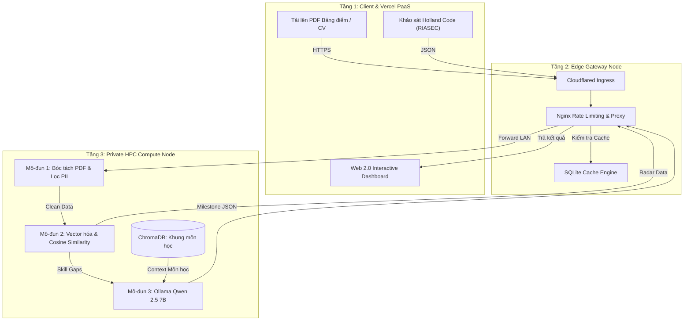

# HỒ SƠ PHÂN TÍCH DỰ ÁN CHI TIẾT (PROJECT ANALYSIS DOCUMENT)

## TÊN DỰ ÁN: MAJORMATCH
### Hệ thống phân tích kỹ năng và định hướng học tập thông minh cho học sinh, sinh viên theo kiến trúc Hybrid Cloud
**Mã tài liệu:** MM-DOC-01-ANALYSIS  
**Phiên bản:** 1.0.0  
**Tác giả:** Chief Cloud Solutions Architect & Technical Lead  
**Ngày cập nhật:** 05/09/2026  

---

## 1. TỔNG QUAN DỰ ÁN & BỐI CẢNH THỰC HIỆN

### 1.1. Mô tả dự án & Tuyên ngôn sứ mệnh
**MajorMatch** là nền tảng ứng dụng kết hợp trí tuệ nhân tạo (AI), học máy (Machine Learning) và công nghệ Web 2.0 hiện đại nhằm giải quyết bài toán tư vấn định hướng chuyên ngành và lộ trình nghề nghiệp cho học sinh phổ thông và sinh viên đại học. 

Khác với các ứng dụng khảo sát đơn thuần hoặc các chatbot AI thương mại chỉ cung cấp lời khuyên định tính, MajorMatch hoạt động như một hệ thống đánh giá năng lực định lượng:
* Tiếp nhận và bóc tách dữ liệu học tập thực tế (bảng điểm học kỳ, CV cá nhân) kết hợp bài trắc nghiệm tâm lý học định hướng (Holland Code - RIASEC).
* Áp dụng thuật toán học máy vector hóa để đo lường chính xác khoảng cách kỹ năng (Skill Gap Analysis) so với chuẩn đầu ra của từng chuyên ngành đào tạo.
* Tự động sinh lộ trình học tập cá nhân hóa từng kỳ học (Milestone-based Roadmap) có tính đến ràng buộc môn học tiên quyết.
* Cung cấp không gian làm việc tương tác động (Web 2.0 Dynamic Workspace) giúp sinh viên theo dõi tiến độ và nhìn thấy sự thay đổi năng lực tức thì theo thời gian thực.

### 1.2. Phân tích các Pain Points (Nỗi đau thực tế) của người dùng

#### A. Sự mông lung trong định hướng và lãng phí nguồn lực giáo dục
* Học sinh THPT khi bước vào ngưỡng cửa đại học thường chọn ngành theo phong trào, định hướng cảm tính của gia đình hoặc tên gọi hấp dẫn của ngành nghề mà không nắm rõ nội dung đào tạo thực tế.
* Sinh viên đại học bước sang năm 2 hoặc năm 3 thường rơi vào khủng hoảng định hướng: Không biết những môn mình đã học có ứng dụng được vào công việc thực tế hay không; thiếu tự tin khi ứng tuyển thực tập vì không biết mình còn thiếu những kỹ năng gì.
* Tỷ lệ sinh viên đại học tốt nghiệp làm trái ngành hoặc phải đào tạo lại sau khi ra trường tại Việt Nam hiện ở mức rất cao, gây lãng phí nghiêm trọng thời gian của cá nhân và chi phí xã hội.

#### B. Sự thiếu thực tế và thiếu ngữ cảnh cục bộ của các mô hình AI thương mại
* Khi sinh viên tham vấn các mô hình AI tổng quát (ChatGPT, Claude, Gemini Cloud):
  * Câu trả lời thường mang tính lý thuyết chung chung, không gắn liền với khung chương trình đào tạo của từng trường đại học cụ thể (ví dụ: không biết môn *Giải thuật nâng cao* hay *Cơ sở dữ liệu* tại trường là môn tiên quyết bắt buộc trước khi học *Khai phá dữ liệu*).
  * Các mô hình SaaS không thể tra cứu cơ sở dữ liệu khung môn học của trường nếu không được nạp dữ liệu RAG chuyên biệt.
  * Phản hồi của LLM thương mại có xu hướng phóng đại hoặc đưa ra danh sách kỹ năng quá rộng lớn, gây quá tải tâm lý cho sinh viên thay vì phân rã thành các bước hành động cụ thể theo từng học kỳ.

#### C. Rủi ro nghiêm trọng về rò rỉ dữ liệu cá nhân nhạy cảm (Confidential Data Leakage)
* Bảng điểm học tập (Transcript), mã số sinh viên (MSSV), điểm số GPA, quá trình học tập và thông tin CV là dữ liệu nhạy cảm (*Confidential / Personally Identifiable Information - PII*).
* Việc người dùng tải trực tiếp bảng điểm chứa đầy đủ thông tin cá nhân lên các dịch vụ đám mây công cộng bên thứ ba tiềm ẩn nguy cơ:
  * Vi phạm các quy định bảo vệ dữ liệu cá nhân (Nghị định 13/2023/NĐ-CP của Việt Nam và chuẩn GDPR quốc tế).
  * Nguy cơ các nhà cung cấp AI SaaS sử dụng dữ liệu học tập cá nhân để huấn luyện lại mô hình công khai.
  * Rủi ro lộ lọt thông tin điểm số gây tổn hại danh dự và tâm lý cá nhân của người học.

### 1.3. Động lực & Giá trị giải pháp của MajorMatch

#### A. Phân tích định lượng thay vì trực giác cảm tính
* Thay thế những câu hỏi phỏng vấn mơ hồ bằng thuật toán toán học chuẩn xác: Chuyển đổi dữ liệu môn học và điểm số thành vector năng lực trong không gian n-chiều.
* Đo lường mức độ phù hợp bằng thuật toán **Cosine Similarity**, giúp người học nhìn thấy chính xác chỉ số % tương thích với từng vị trí nghề nghiệp mục tiêu.
* Phân rã kỹ năng trực quan trên biểu đồ mạng nhện (Radar Chart) đa chiều, phản ánh chính xác điểm mạnh và lỗ hổng kiến thức cần lấp đầy.

#### B. Kiến trúc Hybrid Cloud bảo mật dữ liệu tuyệt đối (Zero-SaaS-Leakage)
* Kết hợp mô hình **Public Cloud** và **Private HPC Node**:
  * **Public Cloud (Vercel PaaS):** Đóng vai trò lớp trình diễn (Presentation Layer), phục vụ đại chúng với tốc độ cao, giao diện Web 2.0 hiện đại.
  * **Private Compute Node (Dedicated GPU-accelerated Server):** Toàn bộ tệp PDF nhạy cảm, quá trình bóc tách điểm số, lưu trữ vector và suy luận LLM (Qwen 2.5 7B qua Ollama) được thực thi hoàn toàn khép kín trong môi trường máy chủ nội bộ.
  * Không có bất kỳ byte dữ liệu bảng điểm nào bị gửi sang máy chủ của bên thứ ba.

#### C. Tự chủ công nghệ và tối ưu hóa 100% chi phí vận hành
* Tận dụng thiết bị biên chuyên dụng (Edge Gateway) và cụm GPU cục bộ mạnh mẽ giúp hệ thống vận hành hoàn toàn không phát sinh chi phí duy trì máy chủ GPU đắt đỏ trên AWS/GCP (thường từ $500 - $1,500/tháng cho cụm GPU suy luận).

---

## 2. KIẾN TRÚC HỆ THỐNG PHÂN TẦNG (HYBRID CLOUD MULTI-TIER ARCHITECTURE)

Hệ thống được thiết kế phân tầng chuẩn mực theo các mô hình dịch vụ đám mây (PaaS, IaaS/Bare-metal, Edge Computing):

```text
==========================================================================================
                     MÔ HÌNH KIẾN TRÚC PHÂN TẦNG HYBRID CLOUD MAJORMATCH
==========================================================================================

 [ CLIENT BROWSER / MOBILE DEVICE ] (Người dùng cuối truy cập giao diện Web 2.0)
                 │ 
                 │ HTTPS (TLS 1.3 - JSON REST / Server-Sent Events)
                 ▼
┌────────────────────────────────────────────────────────────────────────────────────────┐
│ TẦNG 1: PUBLIC PAAS LAYER (Triển khai trên Vercel Global Edge Network)                 │
│ - Framework: Next.js 14 (App Router), TypeScript, Tailwind CSS, Recharts              │
│ - CI/CD: Tự động Build & Deploy liên tục thông qua Git Commit                          │
│ - Chức năng:                                                                           │
│   + Cung cấp giao diện tương tác người dùng (UI/UX), hỗ trợ Responsive                │
│   + Tiếp nhận file PDF học bạ/CV, khảo sát trắc nghiệm Holland Code (Slider)           │
│   + Quản trị trạng thái tương tác động Web 2.0 (Zustand State Management)              │
│   + Trực quan hóa dữ liệu qua biểu đồ Radar Chart và sơ đồ lộ trình học tập            │
│   + Stream phản hồi từ Trợ lý Chatbot nội bộ theo thời gian thực                       │
└───────────────────────────────────────────┬────────────────────────────────────────────┘
                                            │ Cloudflare Tunnel (Kênh mạng ảo mã hóa mTLS)
                                            ▼
┌────────────────────────────────────────────────────────────────────────────────────────┐
│ TẦNG 2: EDGE CONTROL PLANE & GATEWAY (Linux Edge Gateway / SBC Node)                   │
│ - Phần cứng: Kiến trúc ARM64 hoặc x86_64 (tối thiểu 2GB RAM), Ubuntu Linux             │
│ - Phần mềm: Nginx Reverse Proxy, Cloudflared Daemon, SQLite Cache DB                   │
│ - Chức năng:                                                                           │
│   + Điểm Ingress duy nhất kết nối mạng Internet công cộng với mạng nội bộ              │
│   + Điều phối luồng và cân bằng tải (Traffic Routing & Proxy Pass)                     │
│   + Phòng chống quá tải cho GPU Backend (Token Bucket Rate Limiting: 10 req/phút/IP)   │
│   + Quản lý phiên làm việc và bộ đệm phản hồi kết quả tĩnh (Response Cache với SQLite) │
│   + Chuyển tiếp Request về Private Node qua mạng LAN nội bộ                            │
└───────────────────────────────────────────┬────────────────────────────────────────────┘
                                            │ Mạng LAN nội bộ (1Gbps Ethernet / Wi-Fi 5GHz)
                                            │ Giao thức: HTTP RESTful JSON API
                                            ▼
┌────────────────────────────────────────────────────────────────────────────────────────┐
│ TẦNG 3: PRIVATE HPC COMPUTE NODE (Dedicated GPU Workstation: NVIDIA CUDA >= 6GB VRAM)  │
│ - Ảo hóa & Môi trường: Docker Containerization, Python 3.11 FastAPI Backend            │
│ - Mô-đun AI/ML Cục bộ:                                                                 │
│   + PDF Parser & Regex Engine: Bóc tách text, lọc cấu trúc điểm số, làm sạch PII      │
│   + Scikit-learn & NumPy: Vector hóa tập kỹ năng, tính Cosine Similarity               │
│   + Vector Database: ChromaDB (Lưu trữ khung chương trình đào tạo & chuẩn đầu ra)      │
│   + Local LLM Inference Engine: Ollama chạy mô hình Qwen 2.5 (7B Instruct - Q4_K_M)    │
│ - Quản trị dữ liệu bảo mật:                                                            │
│   + Lưu trữ dữ liệu học bạ/CV nhạy cảm trên phân vùng mã hóa nội bộ                    │
│   + Thực thi chính sách dọn dẹp bộ nhớ tạm sau phiên tính toán (Ephemeral Cleanup)     │
└────────────────────────────────────────────────────────────────────────────────────────┘
```

### 2.1. Phân tích chi tiết Tầng 1: Public PaaS Layer (Vercel)
* **Bản chất dịch vụ:** Tận dụng nền tảng PaaS Serverless của Vercel phân phối qua mạng Anycast CDN toàn cầu.
* **Lợi ích kiến trúc:**
  * Khả năng tự động mở rộng (Auto-scaling) gần như không giới hạn khi số lượng sinh viên truy cập cùng lúc tăng vọt trong các đợt xét tuyển.
  * Giảm thiểu tối đa độ trễ tải trang ban đầu (First Contentful Paint < 0.8s) do tài nguyên tĩnh được nén và cache tại các PoP CDN gần người dùng nhất.
  * Tích hợp quy trình CI/CD chuyên nghiệp: Mọi commit trên nhánh `main` tự động kích hoạt pipeline kiểm thử linter và triển khai bản build mới mà không gây gián đoạn dịch vụ (Zero Downtime).

### 2.2. Phân tích chi tiết Tầng 2: Edge Gateway & Control Plane
* **Bản chất kiến trúc:** Sử dụng một thiết bị biên độc lập (ARM64 SBC hoặc Linux Gateway) cài đặt môi trường Ubuntu Linux.
* **Lợi ích chiến lược:**
  * **Tách biệt mặt phẳng điều khiển (Control Plane Isolation):** Máy chủ tính toán Private Node không cần mở bất kỳ cổng kết nối nào ra ngoài Internet, cũng không cần chạy daemon Cloudflare Tunnel. Toàn bộ áp lực kết nối mạng bên ngoài do Edge Gateway tiếp nhận và hấp thụ.
  * **Bảo vệ phần cứng GPU (Backpressure Protection):** Mô hình AI chạy trên GPU có giới hạn về số lượng yêu cầu xử lý đồng thời. Edge Gateway đóng vai trò "van điều tiết" với Nginx Rate Limiting: Chặn đứng các đợt spam request hoặc tấn công DoS trước khi chúng có cơ hội chạm tới GPU Backend.
  * **Tiết kiệm năng lượng:** Edge Gateway có thể duy trì hoạt động 24/7 với mức tiêu thụ điện cực thấp, sẵn sàng nhận diện tín hiệu đánh thức hoặc giữ kết nối đường hầm Cloudflare Tunnel ổn định.

### 2.3. Phân tích chi tiết Tầng 3: Private HPC Compute Node (GPU Server)
* **Bản chất kiến trúc:** Trạm tính toán nội bộ (On-premise Compute Node) sở hữu vi xử lý hiệu năng cao và card đồ họa chuyên dụng NVIDIA CUDA (Tối thiểu 6GB VRAM, khuyến nghị 8GB+ VRAM).
* **Lợi ích chiến lược:**
  * **Xử lý song song bằng GPU:** Tăng tốc suy luận ma trận của các thuật toán ML và chạy trực tiếp mô hình ngôn ngữ lớn Qwen 2.5 (7B) với lượng VRAM chiếm dụng lý tưởng (~5.2GB trên phiên bản lượng tử hóa Q4_K_M).
  * **Bảo mật vật lý (Air-gapped Boundary Option):** Tất cả các tệp PDF học bạ/CV chỉ được giải mã và lưu tạm trong RAM máy chủ nội bộ. Hoàn toàn cách ly khỏi mọi nguy cơ rò rỉ trên Internet công cộng.

---

## 3. PHÂN TÍCH CHI TIẾT CÁC MÔ-ĐUN NGHIỆP VỤ & KỸ THUẬT CỐT LÕI



### Mô-đun 1: Bóc tách & Tiếp nhận Hồ sơ (Profile Ingestion & Parsing)
* **Nhiệm vụ:** Tiếp nhận tệp tin nhị phân PDF từ Client, giải nén dữ liệu văn bản, nhận diện cấu trúc học tập và làm sạch thông tin định danh cá nhân (PII Scrubbing).
* **Quy trình kỹ thuật:**
  1. **Nhận diện định dạng & Kiểm tra an toàn:** Đọc magic bytes (`%PDF-1.x`) để đảm bảo không bị tấn công thực thi mã từ xa thông qua file giả mạo.
  2. **Trích xuất văn bản (Text Extraction):** Áp dụng thư viện `pdfplumber` để bóc tách text theo tọa độ khối, bảo toàn cấu trúc dòng và cột của bảng điểm học tập.
  3. **Bộ phân tích cú pháp biểu thức chính quy (Regex Engine):**
     * Nhận diện mã môn học: `^[A-Z]{2,4}\s?[0-9]{3,4}$` (ví dụ: `CS101`, `IT3020`, `MTH100`).
     * Nhận diện điểm số: Bóc tách điểm hệ 10 (`\b[0-9](\.[0-9]{1,2})?\b`), điểm hệ chữ (`\b[A-F][+-]?\b`) và số tín chỉ (`\b[1-6]\s?(tín|tc|credits)?\b`).
     * Nhận diện GPA tổng kết: `(GPA|Điểm trung bình tích lũy)[:\s]*([0-4]\.[0-9]{1,2})`.
  4. **Khử định danh nhạy cảm (PII Redaction):** Tự động phát hiện và xóa bỏ các trường: Số định danh cá nhân/CCCD, Số điện thoại di động, Địa chỉ thường trú. Chỉ giữ lại danh sách môn học, số tín chỉ và điểm số phục vụ thuật toán.

### Mô-đun 2: Định lượng Năng lực & Khoảng cách Kỹ năng (ML Skill Gap Engine)
* **Nhiệm vụ:** Chuyển đổi dữ liệu học tập thành vector kỹ năng số hóa và đo lường khoảng cách với tiêu chuẩn ngành.
* **Quy trình toán học:**
  1. **Không gian Vector Kỹ năng (Skill Space):**
     Xác định một không gian đặc trưng $N$ chiều tương ứng với $N$ kỹ năng kỹ thuật và mềm trong cơ sở dữ liệu hệ thống (ví dụ: $N = 128$ kỹ năng gồm Python, C++, Data Structures, SQL, System Design, Communication,...).
  2. **Vector hóa hồ sơ sinh viên ($S_{user}$):**
     Mỗi môn học sinh viên đã hoàn thành với điểm số $G_i$ (quy đổi về thang 0.0 – 4.0) sẽ đóng góp trọng số vào các kỹ năng thành phần theo ma trận ánh xạ môn học - kỹ năng $M_{course \to skill}$:
     $$S_{user}[j] = \sum_{i} \left( \frac{G_i}{4.0} \times W_{ij} \right)$$
     *(trong đó $W_{ij}$ là trọng số thể hiện mức độ đóng góp của môn học $i$ cho kỹ năng $j$)*.
  3. **Đo lường độ tương đồng Cosine Similarity:**
     So sánh vector $S_{user}$ với vector chuẩn của ngành mục tiêu $S_{benchmark}$:
     $$\text{Cosine Similarity}(S_{user}, S_{benchmark}) = \frac{S_{user} \cdot S_{benchmark}}{\|S_{user}\|_2 \|S_{benchmark}\|_2} = \frac{\sum_{k=1}^N S_{user}[k] S_{benchmark}[k]}{\sqrt{\sum_{k=1}^N (S_{user}[k])^2} \sqrt{\sum_{k=1}^N (S_{benchmark}[k])^2}}$$
     Điểm phù hợp tổng kết được nhân với hệ số điều chỉnh từ bài trắc nghiệm Holland Code để ra chỉ số **Overall Match Score %**.
  4. **Phân rã khoảng cách kỹ năng (Skill Gap Vector):**
     $$\Delta S = \max(0, S_{benchmark} - S_{user})$$
     Các chiều có $\Delta S > 0$ được sắp xếp theo mức độ cấp thiết để chuyển tiếp sang Mô-đun 3.

### Mô-đun 3: Suy luận Ngữ cảnh & Sinh Lộ trình (RAG & Generative AI)
* **Nhiệm vụ:** Sinh lộ trình học tập cá nhân hóa, khả thi và hợp lý về mặt thứ tự môn học.
* **Quy trình kỹ thuật:**
  1. **Truy xuất ngữ cảnh từ ChromaDB (Retrieval Phase):**
     Với tập hợp các kỹ năng còn thiếu ($\Delta S$), hệ thống truy vấn vào Vector DB chứa toàn bộ cây chương trình đào tạo của trường để lấy về:
     * Danh sách các môn học cung cấp kỹ năng này.
     * Danh sách môn tiên quyết của từng môn (Prerequisites Chain).
     * Số tín chỉ và kỳ mở môn (Kỳ Thu / Kỳ Xuân).
  2. **Kiến tạo Prompt có cấu trúc (Prompt Engineering):**
     Prompt gửi vào LLM được đóng gói kèm:
     * Dữ liệu GPA và các môn sinh viên đã vượt qua.
     * Top ngành nghề mục tiêu và các kỹ năng đang khuyết thiếu.
     * Đoạn ngữ cảnh trích xuất từ ChromaDB về khung môn học của trường.
     * Yêu cầu bắt buộc trả về định dạng **JSON Schema** chuẩn mực (không sinh văn bản rác ngoài JSON).
  3. **Thực thi suy luận (Inference Phase với Qwen 2.5 7B):**
     Ollama điều phối tính toán trên Compute Node (GPU), sinh ra cấu trúc các Milestone:
     ```json
     {
       "target_major": "AI & Data Science Specialist",
       "readiness_score": 64.5,
       "semesters": [
         {
           "semester_name": "Học kỳ đề xuất tiếp theo (Kỳ 5)",
           "recommended_courses": [
             {
               "course_code": "CS301",
               "course_name": "Nhập môn Trí tuệ Nhân tạo",
               "reason": "Bù đắp lỗ hổng thuật toán tìm kiếm và logic mờ, tiền đề cho Machine Learning."
             }
           ],
           "certifications": ["Coursera Deep Learning Specialization"],
           "practical_project": "Xây dựng pipeline phân loại văn bản tiếng Việt sử dụng Scikit-learn"
         }
       ]
     }
     ```

### Mô-đun 4: Không gian Tương tác Web 2.0 (Interactive Workspace Dashboard)
* **Nhiệm vụ:** Mang lại trải nghiệm người dùng sống động, phản hồi tức thời theo chuẩn Web 2.0.
* **Tính năng chuyên sâu:**
  * **Dynamic State Tracking (Theo dõi trạng thái động):** Sử dụng store quản lý trạng thái Client (Zustand/React State). Người dùng có thể đánh dấu vào các checkbox lộ trình (ví dụ: "Đã tự học xong Python nâng cao"). Ngay khi tích chọn, client tự động cộng điểm trọng số kỹ năng, gọi hàm tái tính toán cục bộ và vẽ lại biểu đồ Radar mà không cần gửi request phân tích lại toàn bộ file PDF.
  * **Radar Chart Trực quan hóa (Recharts):** Biểu diễn đồng thời 2 lớp polygon màu sắc tương phản: Màu lam nhạt thể hiện năng lực hiện tại của sinh viên, viền màu cam neon thể hiện chuẩn mực yêu cầu của ngành nghề.
  * **Streaming Chatbot Assistant:** Giao tiếp với endpoint Server-Sent Events (SSE) của FastAPI, hiển thị từng từ phản hồi của mô hình Qwen 2.5 theo phong cách gõ chữ thời gian thực (Typing effect), giảm thiểu cảm giác chờ đợi của người dùng.

### Mô-đun 5: Cổng Điều phối Biên & An toàn Mạng (Edge Gateway & Traffic Control)
* **Nhiệm vụ:** Đảm bảo hệ thống duy trì hoạt động tin cậy và không bao giờ bị nghẽn phần cứng.
* **Cơ chế kỹ thuật:**
  * **Cloudflare Tunnel (`cloudflared`):** Thiết lập một đường hầm mã hóa outbound từ Edge Gateway ra Edge PoP của Cloudflare. Nhờ đó, mạng gia đình/nội bộ không cần mở cổng NAT (Port Forwarding), không cần IP tĩnh công cộng, loại bỏ nguy cơ bị scan cổng từ hacker.
  * **Nginx Token Bucket Rate Limiter:** Cấu hình bộ giới hạn lưu lượng nghiêm ngặt:
    ```nginx
    limit_req_zone $binary_remote_addr zone=ai_limit:10m rate=10r/m;
    server {
        location /api/v1/analyze {
            limit_req zone=ai_limit burst=3 nodelay;
            proxy_pass http://192.168.1.50:8000;
        }
    }
    ```
  * **Bộ nhớ đệm SQLite Response Cache:** Khi nhận yêu cầu phân tích một khung chương trình phổ quát hoặc yêu cầu trùng lặp mã băm hồ sơ, Gateway trích xuất dữ liệu từ file SQLite cục bộ trên Edge Gateway và trả về kết quả trong thời gian $\le 15\text{ms}$.

---

## 4. MA TRẬN SO SÁNH VÀ LÝ DO LỰA CHỌN CÔNG NGHỆ

| Hạng mục / Lớp | Công nghệ lựa chọn | Giải pháp thay thế cân nhắc | Lý do quyết định chọn giải pháp tối ưu |
| :--- | :--- | :--- | :--- |
| **Frontend Framework** | **Next.js 14 (App Router)** | Vite React SPA / Vue 3 | Hỗ trợ Server Components tối ưu SEO, tích hợp chuẩn Vercel deployment, hệ sinh thái phong phú. |
| **Giao diện & Biểu đồ** | **Tailwind CSS + Recharts** | Bootstrap + Chart.js | Tailwind cho phép tùy biến giao diện cao cấp (Glassmorphism), Recharts hỗ trợ vẽ Radar đa lớp SVG mượt mà. |
| **Edge Gateway Node** | **Linux Edge Gateway (Ubuntu / SBC)** | Cloud VPS / Router Gateway | Tiết kiệm chi phí, vận hành độc lập, bảo vệ mạng tính toán nội bộ. |
| **Reverse Proxy & Ingress**| **Nginx + Cloudflared** | Caddy / Traefik | Nginx cực kỳ nhẹ, tối ưu tài nguyên trên chip ARM/x86; Cloudflared miễn phí, bảo mật không cần mở cổng modem. |
| **Backend API Framework** | **FastAPI (Python 3.11)** | Express.js / Django | FastAPI hỗ trợ async bản địa, tích hợp sẵn Pydantic xác thực dữ liệu và tương thích trực tiếp hệ sinh thái AI/ML Python. |
| **Mô hình AI Suy luận** | **Qwen 2.5 (7B) qua Ollama** | LLaMA 3 / Claude API | Qwen 2.5 7B có khả năng hiểu tiếng Việt vượt trội, bám sát chỉ dẫn cấu trúc JSON và chạy mượt mà trên GPU CUDA (VRAM >= 6GB). |
| **Vector Database** | **ChromaDB** | Pinecone / Milvus | ChromaDB mã nguồn mở, hỗ trợ chạy embedded trực tiếp trong container cục bộ, không tốn chi phí thuê cloud. |

---

## 5. ĐÁNH GIÁ CHỈ SỐ HOẠT ĐỘNG, NĂNG LỰC TÀI NGUYÊN & YÊU CẦU PHẦN CỨNG

### 5.1. Hồ sơ phần cứng thiết bị triển khai (Hardware Profile)

#### Node 2: Linux Edge Gateway Node
* **CPU:** Vi xử lý kiến trúc ARM64 (Kryo / Cortex-A) hoặc x86_64 (tối thiểu 4 nhân, xung nhịp >= 1.5 GHz).
* **RAM:** Tối thiểu 2GB RAM (Mức chiếm dụng hệ điều hành Ubuntu + Nginx + Cloudflared + SQLite chỉ rơi vào khoảng **650MB - 900MB RAM**, bảo đảm hoạt động đa nhiệm ổn định).
* **Bộ nhớ trong:** Tối thiểu 16GB (Lưu trữ SQLite cache và file logs).

#### Node 3: Private HPC Compute Node
* **CPU:** Vi xử lý đa nhân đa luồng hiệu năng cao (Intel Core / AMD Ryzen).
* **GPU:** NVIDIA CUDA-capable GPU (Tối thiểu 6GB VRAM, khuyến nghị >= 8GB VRAM GDDR6).
* **RAM:** Tối thiểu 16GB RAM.
* **Hệ điều hành:** Linux (Ubuntu 22.04 LTS) hoặc Windows 11 với WSL2 / Docker.
* **Mức độ chiếm dụng tài nguyên dự kiến:**
  * Docker Engine & FastAPI Service: ~450MB RAM.
  * ChromaDB Vector Store: ~300MB RAM.
  * Ollama Core & Qwen 2.5 7B Q4_K_M: **~5.2GB VRAM** và ~1.2GB System RAM.
  * Tổng dung lượng RAM hệ thống sử dụng: $\approx 8.5\text{GB} / 16\text{GB}$ (Đảm bảo an toàn, không gây hiện tượng Out Of Memory hoặc phân trang ổ cứng).

### 5.2. Đo kiểm hiệu năng dự kiến (Performance Benchmarks)
* **Thời gian bóc tách và phân tích PDF:** $\mathbf{0.8 - 1.2\text{ giây}}$ cho tài liệu bảng điểm 2 trang.
* **Thời gian tính toán vector và Cosine Similarity:** $\mathbf{< 150\text{ miligiây}}$.
* **Tốc độ sinh token của LLM (Qwen 2.5 7B):** $\mathbf{45 - 55\text{ tokens/giây}}$ (tăng tốc phần cứng CUDA).
* **Độ trễ phản hồi token đầu tiên (TTFT - Time To First Token):** $\mathbf{< 700\text{ miligiây}}$.
* **Độ trễ trung chuyển qua Cloudflare Tunnel + Edge Gateway:** $\mathbf{40 - 80\text{ miligiây}}$ (với hạ tầng mạng cáp quang thông thường).

---

## 6. MA TRẬN RỦI RO KỸ THUẬT VÀ PHƯƠNG ÁN GIẢM THIỂU (RISK MITIGATION)

| STT | Rủi ro kỹ thuật | Mức độ | Hậu quả tiềm ẩn | Phương án xử lý & Giảm thiểu |
| :---: | :--- | :---: | :--- | :--- |
| **1** | Bảng điểm PDF quét dạng hình ảnh (Scan/Ảnh chụp) | Trung bình | `pdfplumber` không trích xuất được text trực tiếp | Tích hợp module OCR dự phòng (`pytesseract` hoặc `PaddleOCR`) khi độ dài text trích xuất $< 50$ ký tự. |
| **2** | Máy chủ Private Node mất kết nối mạng LAN hoặc sleep | Cao | Toàn bộ yêu cầu phân tích AI bị ngắt quãng | Cài đặt chế độ High Performance không sleep; cấu hình Heartbeat API trên Gateway để cảnh báo nếu mất ping. |
| **3** | Người dùng gửi liên tục nhiều bảng điểm gây nghẽn GPU | Cao | Tràn VRAM GPU dẫn đến crash container | Thiết lập hàng đợi tuần tự (Sequential Semaphore) trong FastAPI backend: Chỉ cho phép xử lý tối đa 1 tác vụ LLM đồng thời; các yêu cầu khác xếp hàng đợi tối đa 30s. |
| **4** | Lỗ hổng bảo mật khi mở đường hầm Cloudflare | Thấp | Bị quét endpoint từ bên ngoài | Cấu hình Cloudflare Access Rule, chỉ cho phép phương thức POST hợp lệ kèm Header định danh bí mật giữa Vercel và Gateway. |
