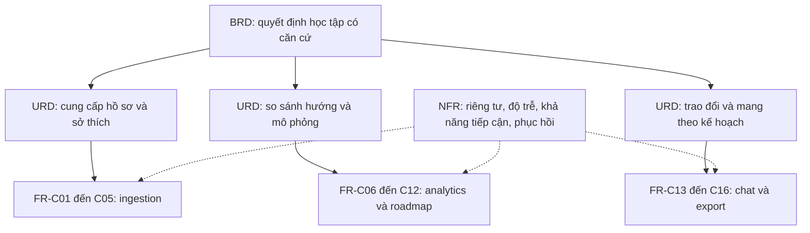
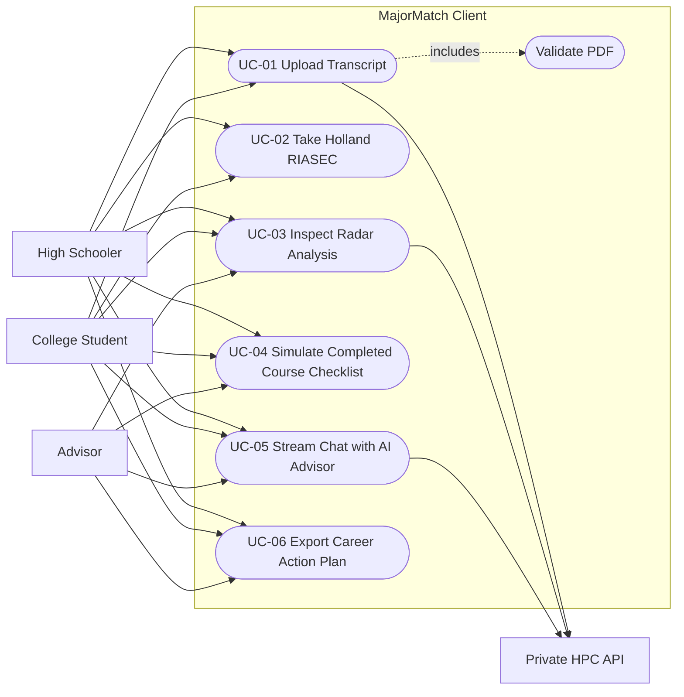

# PHÂN TÍCH YÊU CẦU MAJORMATCH CLIENT

**Mục:** 3.3. **Phiên bản:** 1.0, 08/09/2026. **Phụ trách:** Long Nhật phối hợp Văn Hoàng và Ánh Vy.  
**Trạng thái:** đặc tả mục tiêu; các test ID dưới đây là kế hoạch xác minh, chưa phải kết quả test pass.  
**Nguồn chuẩn:** [PRD 1.0.0](PRD.md), [API_SPEC](../03-specifications/API_SPEC.md), [Discovery](PRODUCT_DISCOVERY.md). Mục 3.2 sử dụng PRD baseline, không tự sửa trạng thái phê duyệt của PRD.

## 1. Phân rã BRD → URD → SRD/FR

| Business requirement | User requirement | Functional/system requirement | Căn cứ |
|---|---|---|---|
| BG-01: hỗ trợ khám phá hướng học có căn cứ | UR-01: tiếp nhận hồ sơ hoặc khảo sát mà không giả mạo dữ liệu | FR-C01 kiểm tra PDF; FR-C02 preview; FR-C03 khảo sát độc lập; FR-C04 career tags | PRD FR-1.1–1.4, FR-2.1 |
| BG-02: giải thích khoảng cách kỹ năng | UR-02: so sánh ngành và hiểu điểm số | FR-C06 radar; FR-C07 top 3; FR-C08 phân loại; FR-C09 đa phương thức; FR-C10 đổi ngành | PRD FR-3.1–3.4, FR-5.1–5.2 |
| BG-03: biến định hướng thành kế hoạch | UR-03: mô phỏng môn học và có kế hoạch mang đi trao đổi | FR-C11 tiên quyết; FR-C12 readiness; FR-C16 xuất kế hoạch | PRD FR-4.4, FR-5.3; export là mở rộng theo đề bài |
| BG-04: hỗ trợ giải thích cá nhân hóa | UR-04: hỏi theo ngành/kỹ năng hiện tại và đọc lại hội thoại | FR-C13 SSE; FR-C14 context; FR-C15 lịch sử/Markdown | PRD FR-5.4; persistence là bổ sung mục 3.4 |
| BG-05: bảo vệ dữ liệu và độ tin cậy phiên | UR-05: nhận biết demo, kiểm soát dữ liệu và phục hồi lỗi | FR-C05 demo có chủ đích; NFR-C01–C06 áp dụng xuyên suốt | PRD NFR-2, NFR-3, NFR-4 |

### 1.1. Phân loại phạm vi và quyết định làm rõ

| Quyết định | Hợp đồng của Chương 3 | Quan hệ baseline |
|---|---|---|
| D-01 dung lượng | “10MB” ở UI nghĩa là 10 MiB = 10.485.760 byte; chấp nhận bằng ngưỡng, từ chối lớn hơn | Làm rõ theo phép tính đang có trong FileDropzone |
| D-02 PDF preview | Client chỉ đọc metadata/page count bằng worker; trích xuất điểm chính thức vẫn tại HPC | Bổ sung preview từ đề bài; không chuyển FR-2 sang frontend |
| D-03 radar | Đúng 6 trục năng lực, miền 0–10 như API; RIASEC là vector sở thích riêng trên 1–5 | Chọn 6 theo AC-02 trong phạm vi 6–8 của FR-3.4; cho phép 0 theo API cần ghi nhận khi duyệt |
| D-04 tốc độ | “Zero latency” nghĩa là không chờ request khi dữ liệu đã có; mục tiêu p95 event-to-paint <50ms | Không cam kết vật lý 0ms; kế thừa AC-04 |
| D-05 skill gap | Mastered ≥3; Developing 2≤x<3; Missing gồm thiếu minh chứng hoặc x<2 với lý do phân biệt | Điểm <2 là làm rõ khoảng trống PRD, không gọi mọi Missing là chưa từng học |
| D-06 timeout | Request nghiệp vụ 15 giây; health 3 giây; SSE kết nối và idle có timer 15 giây riêng | Yêu cầu đề bài; không thay thế mục tiêu hiệu năng inference trong PRD |
| D-07 export | US-ADV-06 xuất Markdown cục bộ, không cần endpoint gửi email hoặc chia sẻ tự động | Mở rộng để UC-06 có story, component và test đầy đủ |
| D-08 persistence | In-memory mặc định; lưu chat cục bộ khi opt-in, 7 ngày, tối đa 50 tin/phiên | Bổ sung theo đề bài; không lưu PDF/GPA vào public cloud |

Nhóm có thể review các quyết định trên như phần bổ sung kỹ thuật; tài liệu này không tuyên bố đã thay đổi baseline được duyệt. Hồ sơ mới phải vô hiệu kết quả/roadmap cũ; đổi ngành hủy chat đang stream và nạp đúng snapshot ngành; dữ liệu thiếu không được tự biến thành fixture trong chế độ thực.

## 2. Use Case Model

Mermaid dùng flowchart và nút oval để biểu diễn use case vì không dùng một cú pháp UML use case không được hỗ trợ. Cố vấn chỉ thao tác trong phiên được người học chủ động chia sẻ, không có quyền mở hồ sơ tùy ý.

HS có thể bỏ qua UC-01; không suy ra PDF là tiên quyết của UC-02. UC-03 tải phân tích một lần; đổi ngành đã cache không gọi HPC. UC-04 không tự cập nhật bảng điểm chính thức. UC-06 có thể xuất sau khi roadmap được tạo và không bắt buộc chat.

### 2.1. UC-01 — Upload & Validate PDF Academic Transcript

| Trường | Đặc tả |
|---|---|
| Use Case ID / Name | UC-01 — Tải và xác thực bảng điểm/CV PDF |
| Primary Actor | Sinh viên; học sinh khi có tài liệu phù hợp |
| Preconditions | Trang ingestion đã tải; chế độ thực/demo rõ; người dùng thấy thông báo nơi xử lý; không có upload khác đang chạy |
| Trigger | Chọn file bằng bàn phím hoặc kéo thả đúng một file |
| Main Success Scenario | 1. Ghi nhận file và request generation mới. 2. Kiểm tra số file, `.pdf` không phân biệt hoa thường, MIME `application/pdf`, size 1–10.485.760 byte. 3. Đọc đầu file và kiểm tra `%PDF-`. 4. Worker đọc page count; hiển thị parsing, số trang và tên file như text. 5. Người dùng xác nhận gửi; client POST multipart tới `/api/v1/profile/upload-transcript` cùng `document_type`. 6. Nhận JSON, kiểm tra schema/miền điểm; adapter tạo view model. 7. Commit profile và provenance cùng lúc; vô hiệu phân tích cũ; hiển thị dấu thành công và dữ liệu để kiểm tra. |
| Alternate / Exception Flows | A1: không có PDF → dùng khảo sát, không tạo kỹ năng giả. A2: MIME rỗng → báo không xác minh loại tệp, yêu cầu xuất lại PDF; không lặng lẽ bỏ kiểm tra. E1 tại 2–3: sai định dạng/0 byte/quá ngưỡng/nhiều tệp → banner cụ thể, không request. E2 tại 4: PDF hỏng/mật khẩu → báo xuất bản không khóa; PDF scan đọc được trang vẫn có thể thiếu dữ liệu học thuật. E3 tại 5: timeout 15 giây hoặc mất mạng → giữ lựa chọn, cho retry/demo chủ động. E4: 413/415/422/429 → thông báo đúng loại, không đổi sang mock. E5: thay file/hủy → abort tác vụ cũ, kết quả đến muộn bị bỏ. |
| Postconditions | Thành công: chỉ hồ sơ đã xác thực thuộc file hiện tại được lưu trong memory. Thất bại: không công bố profile giả và không ghi đè bằng phản hồi cũ. Object URL/worker được dọn khi thay file hoặc rời trang. |

### 2.2. UC-03 — Dynamic Interactive Radar Chart & Skill Gap Evaluation

| Trường | Đặc tả |
|---|---|
| Use Case ID / Name | UC-03 — Xem radar và đánh giá khoảng cách kỹ năng |
| Primary Actor | Sinh viên/học sinh; cố vấn cùng xem phiên chia sẻ |
| Preconditions | Có phân tích schema hợp lệ hoặc fixture được chọn rõ; mỗi ngành có ID ổn định và trạng thái chi tiết xác định |
| Trigger | Mở kết quả hoặc chọn MajorCard khác |
| Main Success Scenario | 1. Sắp xếp điểm giảm dần, xử lý hòa theo ID và lấy tối đa ba ngành. 2. Chọn ngành đầu tiên nếu chưa chọn. 3. Xác minh sáu axis ID duy nhất, cùng thứ tự và miền điểm 0–10. 4. Vẽ polygon sinh viên/benchmark và legend có nhãn. 5. Hiển thị ba nhóm kỹ năng và nguồn/chương trình. 6. Hover, focus hoặc tap trục để đọc số chính xác. 7. Đổi ngành đã cache cập nhật title, radar và bảng trong một state transition, không request và không lẫn dữ liệu cũ. |
| Alternate / Exception Flows | A1: chỉ 1–2 ngành → hiển thị số thực có thông báo, không nhân bản thẻ. A2: thiếu evidence học thuật → ghi “chưa đủ dữ liệu năng lực”, không vẽ polygon sinh viên như số đo thật. A3: cache ngành chưa sẵn → tải chi tiết, skeleton; không áp dụng SLA <50ms cho network. E1: thiếu/trùng axis, NaN hoặc >10 → không vẽ polygon sai, hiển thị lỗi dữ liệu và retry. E2: viewport 375px hoặc không hover → có nút chọn trục/bảng thay thế. E3: response ngành cũ đến muộn → bỏ theo generation ID. |
| Postconditions | Ngành chọn, radar và SkillBreakdown cùng major ID; hồ sơ gốc không bị thay đổi; có thể truy lại provenance. |

### 2.3. UC-05 — Real-time SSE Academic Advising Dialogue

| Trường | Đặc tả |
|---|---|
| Use Case ID / Name | UC-05 — Hội thoại cố vấn qua SSE |
| Primary Actor | Người học; cố vấn cùng tham gia phiên chia sẻ |
| Preconditions | Có ngành đã chọn, missing skills hợp lệ; chế độ thực/demo rõ; không có request chat khác đang chạy |
| Trigger | Người dùng gửi câu hỏi không rỗng, tối đa 2.000 ký tự sau trim |
| Main Success Scenario | 1. Chụp snapshot major ID/name, missing skills, curriculum version và conversation ID. 2. Tạo user message và assistant message với ID riêng; khóa gửi trùng. 3. POST `/api/v1/chat/stream` bằng fetch và AbortController. 4. Kiểm tra HTTP và `text/event-stream` trong 15 giây. 5. Decode UTF-8 tăng dần, tích lũy dòng và sự kiện; chỉ parse JSON sau dòng trống kết thúc event. 6. Append token vào đúng assistant ID; render theo frame, không hiện `data:`. 7. Nhận `done:true`, chốt message hoàn tất, mở lại input; lưu cục bộ chỉ khi opt-in. |
| Alternate / Exception Flows | A1: người dùng Stop → hủy fetch/reader, giữ phần đã nhận với nhãn dừng. A2: người dùng đổi ngành → abort; lượt tiếp theo dùng context mới. E1: 429 → hiện Retry-After, không retry tức thì. E2: idle 15 giây/EOF trước done → đánh dấu interrupted, không báo thành công. E3: JSON sai hoặc event quá giới hạn → dừng và báo lỗi giao thức. E4: connection fail → chính sách reconnect ở FEATURE_SPECIFICATION; không replay POST nếu chưa có bảo đảm idempotency. E5: nội dung PDF/chat chứa lệnh giả → xem là dữ liệu không tin cậy, không có quyền điều khiển tool/hệ thống. |
| Postconditions | Một assistant message tương ứng một request, hoàn tất/dừng/lỗi rõ; không trộn mock vào stream thật; không tự gửi GPA/tên/PDF khi không cần. |

### 2.4. Các use case còn lại

| UC | Tóm tắt đầu vào → kết quả | Điều kiện ngoại lệ trọng yếu |
|---|---|---|
| UC-02 | 10 câu trả lời độc lập + 1–5 tags → vector RIASEC 1–5, progress 100% | Chưa xác nhận câu → không submit; câu cùng nhóm không kéo nhau |
| UC-04 | Roadmap hợp lệ + tập tick mô phỏng → readiness/radar dự kiến | Chặn môn thiếu tiên quyết; bỏ tiên quyết cascade bỏ hậu duệ; không đổi điểm gốc |
| UC-06 | Snapshot ngành và roadmap → file Markdown UTF-8 cục bộ | Không có roadmap → nút disabled có lý do; demo in nhãn trong file; lỗi tải cho phép retry |

## 3. Requirements Traceability Matrix

Component được ghi tương đối với `client/src/`. Dòng “đề xuất” là interface mới cần triển khai. Test ID có tên scenario tương ứng trong ba tệp user stories; mỗi test bao phủ toàn bộ scenario của story tương ứng.

| Business Goal | Requirement ID / PRD | User Story ID | Frontend Component / service | Verification Test ID |
|---|---|---|---|---|
| BG-01, BG-05 | FR-C01 / FR-1.1–1.2 | US-ING-01 | components/upload/FileDropzone.tsx | T-ING-01 |
| BG-01 | FR-C02 / FR-2.1 + D-02 | US-ING-02 | components/upload/FileDropzone.tsx; services/api.ts | T-ING-02 |
| BG-01 | FR-C03 / FR-1.3 | US-ING-03 | components/upload/RiasecSurvey.tsx; types/survey.ts; stores/useProfileStore.ts | T-ING-03 |
| BG-01 | FR-C04 / FR-1.4 | US-ING-04 | components/upload/RiasecSurvey.tsx; stores/useProfileStore.ts | T-ING-04 |
| BG-05 | FR-C05 / NFR-3.2 + demo | US-ING-05 | services/api.ts; services/mockData.ts; app/upload/page.tsx | T-ING-05 |
| BG-02 | FR-C06 / FR-5.2, AC-02 | US-ANA-01 | components/analysis/RadarComparison.tsx | T-ANA-01 |
| BG-02 | FR-C07 / FR-5.1 | US-ANA-02 | components/analysis/MajorCard.tsx; app/result/page.tsx | T-ANA-02 |
| BG-02 | FR-C08 / FR-3.3 | US-ANA-03 | components/analysis/SkillBreakdown.tsx; API adapter đề xuất | T-ANA-03 |
| BG-02 | FR-C09 / NFR-4 | US-ANA-04 | components/analysis/RadarComparison.tsx | T-ANA-04 |
| BG-02 | FR-C10 / FR-5.2 | US-ANA-05 | app/result/page.tsx; stores/useProfileStore.ts | T-ANA-05 |
| BG-03 | FR-C11 / FR-4.4 | US-ADV-01 | components/roadmap/MilestoneTree.tsx; InteractiveTask.tsx | T-ADV-01 |
| BG-03 | FR-C12 / FR-5.3, AC-04 | US-ADV-02 | stores/useProfileStore.ts; components/roadmap/InteractiveTask.tsx | T-ADV-02 |
| BG-04 | FR-C13 / FR-5.4 | US-ADV-03 | components/chat/StreamingChatBox.tsx; services/api.ts | T-ADV-03 |
| BG-04, BG-05 | FR-C14 / FR-5.4, NFR-2.4 | US-ADV-04 | components/chat/StreamingChatBox.tsx; services/api.ts | T-ADV-04 |
| BG-04, BG-05 | FR-C15 / D-08 | US-ADV-05 | components/chat/StreamingChatBox.tsx; stores/useProfileStore.ts | T-ADV-05 |
| BG-03 | FR-C16 / D-07 | US-ADV-06 | components/roadmap/ExportCareerPlan.tsx — đề xuất | T-ADV-06 |
| BG-02, BG-03 | NFR-C01 / AC-04, D-04 | US-ANA-05, US-ADV-02 | store; RadarComparison; readiness display | T-PERF-01 |
| BG-01, BG-02 | NFR-C02 / NFR-4.1–4.2 | US-ING-01, US-ING-03, US-ANA-04, US-ADV-01 | input, slider, radar, checkbox | T-A11Y-01 |
| BG-05 | NFR-C03 / NFR-2 | US-ING-01, US-ADV-04, US-ADV-05 | request serializers; storage; chat renderer | T-SEC-01 |
| BG-05 | NFR-C04 / D-06 | US-ING-05, US-ADV-03 | services/api.ts | T-NET-01 |
| BG-05 | NFR-C05 / NFR-3.2 | US-ING-05 | mockData; demo banner toàn tuyến | T-DEMO-01 |
| BG-01, BG-02, BG-04 | NFR-C06 / API contract | US-ING-02, US-ANA-01, US-ADV-03 | types/api.ts; API adapter; stream parser | T-CONTRACT-01 |

### 3.1. Cách xác minh yêu cầu xuyên suốt

| Test | Thiết kế phép kiểm tra và oracle |
|---|---|
| T-PERF-01 | Production build, Edge stable trên thiết bị ghi rõ cấu hình, cache 3 ngành/100 task; chạy 30 lần đổi ngành và 30 tick sau warmup. Đo từ event handler đến paint chứa dữ liệu mới; p95 <50ms, 0 network request cho mutation local. Ghi riêng animation; không dùng thời gian dispatch để thay paint. |
| T-A11Y-01 | 375, 640, 768, 1024 và 1920px; zoom 200%; bàn phím từ input đến export. Không tràn ngang toàn trang, focus thấy rõ, nhãn accessible, checkbox/slider thao tác chuẩn; đối chiếu WCAG 2.1 AA trong PRD. |
| T-SEC-01 | Fixture chứa HTML/script, URL javascript, tên/GPA giả lập; kiểm tra DOM không execute, request context chỉ allowlist, storage không chứa PDF/PII của fixture. Quan sát network/logging qua deployment để kiểm tra chính sách HPC. |
| T-NET-01 | Giả lập 413/415/422/429/500, offline, timeout 15s, SSE idle và abort; mỗi trường hợp ra state xác định, không success mock ngoài demo, timer/reader được cleanup. |
| T-DEMO-01 | Backend tắt; app đã load → chọn demo → fixture cố định, banner ở result/roadmap/chat/export. Cold-load offline không hứa hoạt động khi chưa có service worker/cache app shell. |
| T-CONTRACT-01 | Gửi fixture theo API_SPEC/backend schema, xác nhận route, multipart, mapping field, 6 axis, major details và SSE phân mảnh. Thiếu dữ liệu per-major phải báo thiếu, không tái dùng benchmark ngành khác. |

Không suy ra E2E pass từ `next build`. [TESTING_PLAN](../05-testing-and-rules/TESTING_PLAN.md) là chiến lược nền; các test Chương 3 bổ sung oracle/frontend cases. Package hiện không có script unit/E2E, nên các ID là đặc tả kiểm thử cần được hiện thực hóa.

## 4. Biên client và ràng buộc kỹ thuật

| Ràng buộc | Phân tích và quyết định |
|---|---|
| Next.js 14 App Router / strict TS | Component dùng File, storage, chart hoặc store là client component; chỉ truy cập window sau mount. Dữ liệu network đi qua validator runtime; interface TypeScript không kiểm tra JSON khi chạy. |
| Edge trên Windows | Kiểm tra File API, ReadableStream, TextDecoder, AbortController và ResizeObserver bằng feature detection. Khi không có AbortSignal.timeout, dùng AbortController + timer. Không cam kết hỗ trợ IE hoặc EdgeHTML cũ. |
| SSE POST | Dùng fetch streaming cho JSON body; EventSource constructor không cung cấp cơ chế POST body tùy ý. Parser tuân thủ framing, không đồng nhất chunk mạng với event. |
| Giới hạn upload | 10.485.760 byte tính riêng file; multipart có overhead. Gateway phải cho request envelope đủ lớn đồng thời backend kiểm tra file; tránh route qua serverless body limit không tương thích. |
| PDF worker | Chỉ preview metadata, không chạy script PDF; giới hạn đề xuất 100 trang/15 giây preview để bảo vệ UI. PDF parser là phụ thuộc mới, package hiện chưa có. |
| Network / TLS / CORS | Production dùng HTTPS gateway allowlist origin. Trang HTTPS không gọi HTTP LAN bằng cách bỏ bảo vệ mixed content; demo LAN cần origin và cấu hình phù hợp. Không đưa origin secret vào NEXT_PUBLIC hoặc browser bundle. |
| Offline | Mock demo chỉ dùng fixture tổng hợp và chủ động bật. LAN backend còn hoạt động khác với demo browser; app chưa cache không thể cold-load khi Internet mất. navigator.onLine chỉ là tín hiệu, không chứng minh HPC khỏe. |
| Breakpoints | Mobile-first; <640px một cột, sm=640, md=768, lg=1024; chart parent min-w-0, chiều cao xác định; test cả 375px và nhãn tiếng Việt dài. |
| Dữ liệu cố vấn | Cùng xem phiên hoặc nhận export tự nguyện; không truy cập đa sinh viên, không dùng localStorage làm xác thực. |
| Tiên quyết / nguồn | HPC cung cấp DAG, ID và phiên bản chương trình; client kiểm tra trước khi mô phỏng. Boolean prerequisites_satisfied không đủ mô tả toàn bộ dependency graph. |

Tham chiếu kỹ thuật: [WHATWG — Server-sent events](https://html.spec.whatwg.org/multipage/server-sent-events.html), [Recharts — ResponsiveContainer](https://recharts.github.io/en-US/api/ResponsiveContainer/), [Zustand — selector patterns](https://github.com/pmndrs/zustand), truy cập 08/09/2026. Áp dụng API theo major version đang có trong `package.json`, không tự nâng thư viện từ tài liệu mới nhất.

## 5. Khoảng cách xác minh được trong checkout

Nguồn code tại commit repository cha `2a33ec54721c8138d78399531e9040b720d942d1`; đây là đọc tĩnh, không phải kết quả chạy UI.

| ID / mức ưu tiên | Hiện trạng | Tác động / yêu cầu xử lý |
|---|---|---|
| GAP-01 / P0 | FileDropzone chỉ kiểm đuôi và size | Thêm MIME, magic bytes, empty/multiple file, preview và trạng thái hủy; US-ING-01–02 |
| GAP-02 / P0 | RiasecSurvey bind `riasecScores[q.group]` | Nhiều câu cùng nhóm thay đổi cùng nhau; chuyển answers theo question ID rồi tính trung bình; US-ING-03 |
| GAP-03 / P0 | API service catch mọi lỗi và trả mock; health cũng trả mock | Che lỗi 404/schema/backend; tách live/demo và giữ lỗi thật; US-ING-05 |
| GAP-04 / P0 | Client dùng parse-transcript, analysis/skill-gap, roadmap/chat; backend khai báo upload-transcript, assessment/calculate-match, chat/stream | Đồng bộ route và DTO; không thể coi đã tích hợp đúng chỉ vì demo chạy |
| GAP-05 / P0 | `types/api.ts` khác API_SPEC: profile/profile_data, match_score/match_percentage, top_recommendations/top_matches; API chỉ trả một bộ radar/skill breakdown | Adapter không thể tạo chi tiết mọi ngành từ dữ liệu không có; cần API per-major hoặc aggregate mới |
| GAP-06 / P0 | Store dùng `readiness_score || 60`, cộng/trừ 0,3 từng axis, mutation match_score | Base=0 bị sai; clamp làm mất tính đảo ngược; phải tính từ snapshot bất biến và tập completion |
| GAP-07 / P0 | Backend ml_engine phân loại theo điểm kỹ năng khác ngưỡng PRD, còn tự thêm Missing khi danh sách rỗng | Cần hợp đồng evidence và ngưỡng thống nhất; frontend không được xác nhận bảng hiện tại khớp ngưỡng 4.0 |
| GAP-08 / P1 | Radar đã có ResponsiveContainer, parent 360px | Chưa có bằng chứng lỗi runtime 375px; cần kiểm tra nhãn, tooltip, min-width và bàn phím; không ghi “đã vỡ layout” như quan sát thật |
| GAP-09 / P0 | streamChat đưa nguyên decoded chunk vào onChunk; không parser SSE/timer/abort; onError không được gọi ở catch | Có thể lộ event framing và treo state; triển khai protocol machine, UC-05 |
| GAP-10 / P1 | Chat chỉ gửi message và major, messages là local useState, render plain text | Bổ sung missing skills, IDs, history opt-in, Markdown an toàn và course pills hợp lệ |
| GAP-11 / P1 | InteractiveTask có cert nhưng store xem như course; mẫu số chỉ đếm course/project; chưa có DAG | Thống nhất loại task và trọng số; chặn completion ID lạ; bổ sung tiên quyết |
| GAP-12 / P1 | Chưa có export; trang upload tự gán kỹ năng khi không profile; result/roadmap tự nạp fixture | Xây UC-06; loại fake data khỏi luồng thật; dữ liệu thiếu phải có state rõ |

P0 là cản trở tính đúng/tin cậy của luồng thật; P1 là chức năng cần hoàn thiện trước nghiệm thu phạm vi. Phân công: Văn Hoàng GAP-01–03 và input; Ánh Vy GAP-05,07–08 với backend owner; Long Nhật GAP-04,06,09–12 và giao diện hợp đồng liên module.

## 6. Điều kiện hoàn tất Chương 3 và nghiệm thu sản phẩm

Tài liệu Chương 3 hoàn tất khi có discovery có nguồn/giả thuyết, reference PRD, RTM không orphan, Gherkin có oracle và feature contract giải quyết các điểm mâu thuẫn. Prompt log phải phân biệt ví dụ tái dựng với minh chứng đã thực hiện.

Sản phẩm chỉ nghiệm thu khi các test liên quan chạy trên code triển khai và có bằng chứng kết quả, phiên bản môi trường, người kiểm tra và lỗi còn mở. Chưa có căn cứ trong phiên soạn tài liệu để tuyên bố đạt latency, WCAG, privacy, chính xác trích xuất hoặc hoàn thành góp ý thủ công của ba sinh viên.
